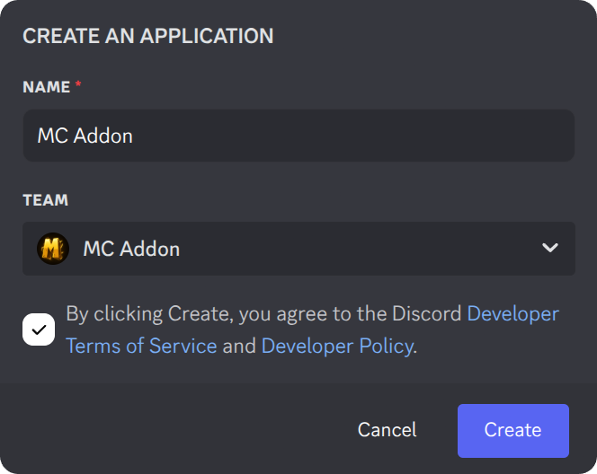
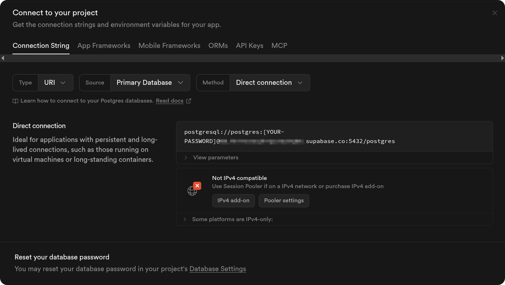
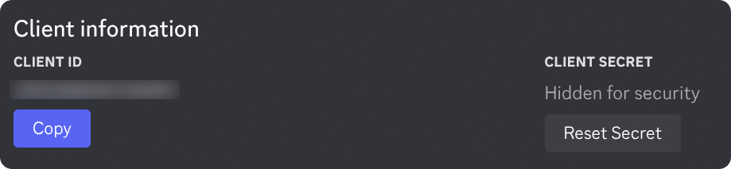
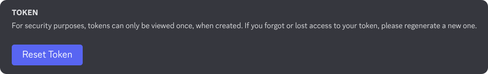
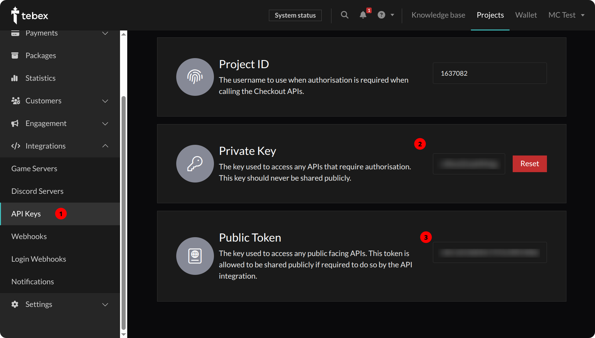
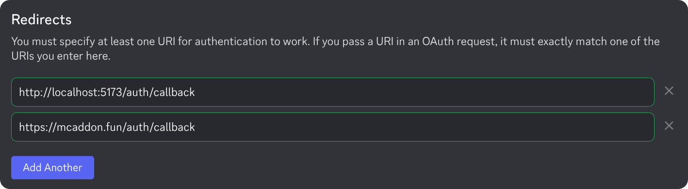
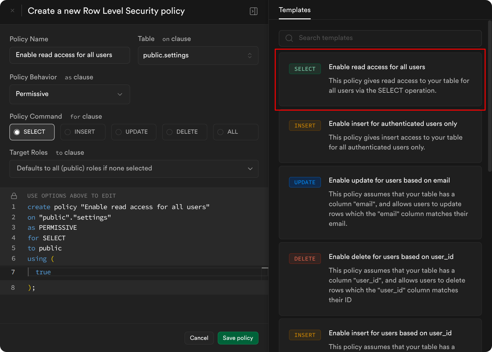

<div align="center">


Official MC Addon Website

</div>

## 🚩 Installation

1. Clone this repository
    ```sh
    git clone https://github.com/mc-addon/mcaddon mcaddon
    cd mcaddon
    ```

2. Install dependencies
    ```sh
    bun i
    ```

3. Create an application at the [Discord Developer Portal](https://discord.com/developers/applications).
    

4. Create `.env` file from `.env.example` in the root directory and fill in the required values.
    <details>

    <summary>ENV Vars</summary>

    - Get `DATABASE_URL` from Supabase.
        
    - Get `DISCORD_CLIENT_ID` and `DISCORD_CLIENT_SECRET` from the Discord Developer Portal.
        
    - Get `DISCORD_BOT_TOKEN` from the Discord Developer Portal.
        
    - Get `JWT_SECRET` by running the following command.
        ```sh
        bun run gen-secret
        ```
    - Get `TEBEX_PRIVATE_KEY` and `PUBLIC_TEBEX_TOKEN` from the Tebex Dashboard.
        

    </details>

5. Add redirect url at the Discord Developer Portal.
    

6. Push the database schema.
    ```sh
    bun run db:push
    ```
7. Navigate to **Table Editor** in Supabase Dashboard and enable **RLS** for all the tables.

8. Navigate to **Authentication** > **Policies** in Supabase Dashboard and create policies for all the tables.
    

9. Start the app
   ```sh
   bun run dev
   ```

> [!IMPORTANT]
> When you add assets to the `/static` directory, run `bun run sync-assets` to save assets path to the `/static/assets.json` file.
> The `/static/assets.json` file is used by the loading screen to preload assets.

## 🚀 Production

1. Follow steps 1-8 from the [installation](#-installation) section.

2. Login to your Cloudflare Account from `wrangler`.
    ```sh
    bunx wrangler login
    ```

3. Create `wrangler.toml` file from `wrangler.toml.example` in the root directory and fill in the required values.
    > *Refer step 4 from the [installation](#-installation) section for ENV Vars.*

4. Deploy
    ```sh
    bunx wrangler deploy
    ```


## ❤️ Contributing

- Things to keep in mind
    - Follow our commit message convention.
    - Write meaningful commit messages.
    - Keep the code clean and readable.
    - Make sure the app is working as expected.

- Code Formatting
    - Run `bun run format` before committing your changes or use [`Prettier`](https://prettier.io/) extension in your code editor.
    - Make sure to commit error free code. Run `bun run check` to check for any errors.

- Check [STYLES.MD](./STYLES.MD) for the CSS style guide.